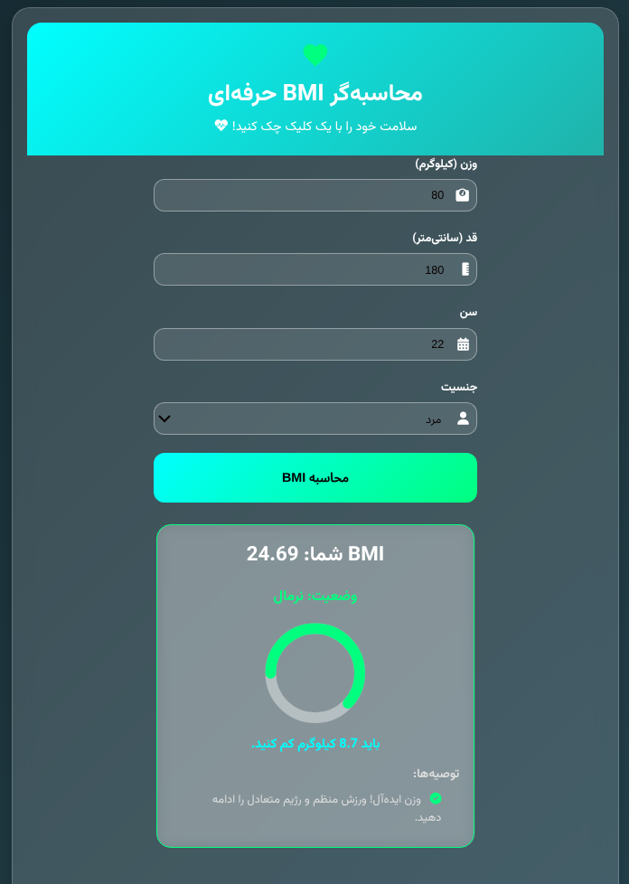

# BMI Calculator App 🚀


[](https://reactjs.org/)
[](https://opensource.org/licenses/MIT)
[](https://mojtabafotohi.github.io/bmi-calculator/)
[](https://github.com/mojtabafotohi/bmi-calculator)

A modern, visually stunning BMI (Body Mass Index) calculator built with React JS. It takes inputs like height, weight, age, and gender to compute BMI, assess weight status (underweight, normal, overweight, obese) with color indicators, calculate ideal weight difference, and offer personalized health tips. Responsive design ensures seamless experience on mobile and desktop. Features elegant animations, particle effects, and a dynamic progress circle.





## ✨ Features

- **User Inputs**: Height (cm), Weight (kg with decimals), Age, Gender. 📏⚖️
- **BMI Calculation**: Standard formula with status categories and colors (blue for underweight, green for normal, orange for overweight, red for obese). 📊
- **Ideal Weight Suggestion**: Computes weight to gain/lose for BMI ~22. ⚖️
- **Personalized Advice**: Tailored tips based on age and gender (e.g., calcium for women, checkups for older users). 💡
- **Visuals**: Framer Motion animations, particle background, SVG heart logo, circular BMI graph. 🎨
- **Responsive**: Fully mobile-friendly with media queries. 📱💻
- **Tech Stack**: React, HTML/CSS, Font Awesome icons, Google Fonts (Vazirmatn). No Tailwind/TypeScript.

## 🛠️ Installation

1. Clone the repository:
   ```
   git clone https://github.com/mojtabafotohi/bmi-calculator.git
   ```
2. Navigate to the project directory:
   ```
   cd bmi-calculator
   ```
3. Install dependencies:
   ```
   npm install
   ```
4. Start the development server:
   ```
   npm start
   ```
   Open [http://localhost:3000](http://localhost:3000) in your browser.

## 📈 Usage

- Enter your details in the form.
- Click "Calculate BMI" to see results in a beautiful card.
- View status, graph, weight adjustment, and advice.
- Responsive on all devices—try resizing your browser!

## 🚀 Deployment

Deployed on GitHub Pages: [Live Demo](https://mojtabafotohi.github.io/bmi-calculator/)

To deploy your own:
1. Add `"homepage": "https://yourusername.github.io/bmi-calculator"` to `package.json`.
2. Install `gh-pages`: `npm install --save gh-pages`.
3. Add deploy script to `package.json`: `"deploy": "gh-pages -d build"`.
4. Run `npm run build` then `npm run deploy`.

## 📝 License

This project is licensed under the MIT License - see the [LICENSE](LICENSE) file for details.

## 👏 Acknowledgments

- Built with ❤️ using React and Framer Motion.
- Icons from Font Awesome.
- Fonts from Google Fonts.

Feel free to fork, star, or contribute! 🌟
